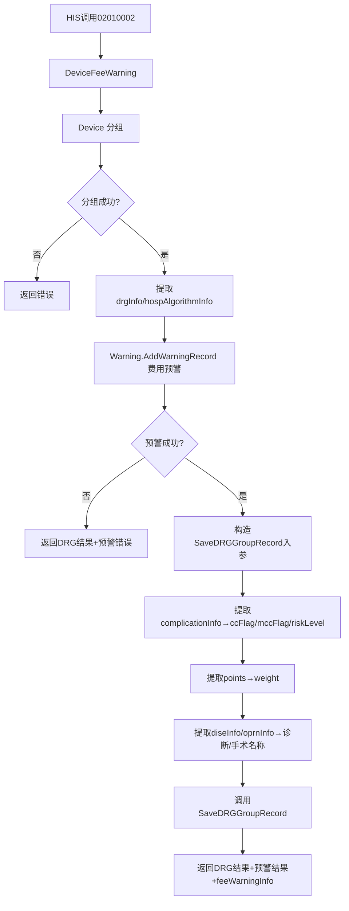

## 用户需求

HIS系统通过调用接口02010002（DeviceFeeWarning）获取DRG分组结果和费用预警结果后，需要自动将DRG分组记录插入到BS_DRGGroupRecord表中。现有02010035接口（SaveDRGGroupRecord）已具备保存分组记录功能，但其入参字段名与02010002使用的字段名不兼容（如02010002使用hisAdmId而02010035使用admID）。

需要完成两项更新：

1. 将02010035的入参字段名改为与02010002一致
2. 在02010002费用预警成功后，调用02010035插入分组记录

## 核心功能

- **入参字段名统一**：SaveDRGGroupRecord方法中3个字段改名（admID→hisAdmId、department→deptCode、departmentDesc→deptName）
- **分组结果提取与传递**：从02010002的DRG分组输出中提取drgInfo（code/desc）、hospAlgorithmInfo（payStandard/points）、complicationInfo（CC/MCC标志），构造SaveDRGGroupRecord入参
- **并发症标志推导**：遍历complicationInfo数组，若存在MCC则mccFlag=1；否则若存在CC则ccFlag=1；riskLevel按MCC→高、CC→中、无→低
- **权重计算**：weight = hospAlgorithmInfo.points / 100（基准点数/100）
- **诊断/手术名称提取**：从diseInfo数组取主诊断名称（mainFlag=1且diagSn=1），从oprnInfo数组取主手术名称（mainFlag=1且oprnSn=1）
- **插入时机控制**：仅在费用预警成功（errorCode=0）后执行插入，预警失败则跳过

## 技术栈

- **语言**：InterSystems Cache ObjectScript（.cls）
- **平台**：InterSystems IRIS / Cache
- **涉及类**：`src.DRG.GroupDevice`（GroupDevice.cls）
- **数据表**：`BS_DRGGroupRecord`（User.BSDRGGroupRecord.cls）

## 实现方案

### 整体策略

分两步修改 `src/src/DRG/GroupDevice.cls`：

1. **修改 SaveDRGGroupRecord 方法**（行2570-2797）：将3个字段名替换为02010002风格：

- 参数提取处：`params.admID` → `params.hisAdmId`，`params.department` → `params.deptCode`，`params.departmentDesc` → `params.deptName`
- 必填校验处：校验变量 `admID` 和 `hisAdmId` 同步改为新变量名
- 查重SQL处：SQL中的变量绑定名不动，仅外层变量名变
- 注释文档处：方法头部的Input示例JSON同步更新

2. **修改 DeviceFeeWarning 方法**（行2242-2248）：在费用预警成功后，新增调用SaveDRGGroupRecord的代码块，构造入参逻辑参考DeviceNew中已注释的代码（行2080-2159）。

### 字段映射明细

| 来源 | 02010002字段 | SaveDRGGroupRecord入参字段 | 提取方式 |
| --- | --- | --- | --- |
| params | hisAdmId | hisAdmId | 直接取值 |
| params | patientName | patientName | 直接取值 |
| params | psnNo | psnNo | 直接取值 |
| params | insuranceAreaCode | insuranceAreaCode | 直接取值 |
| params | mdtrtareaAreaCode | mdtrtareaAreaCode | 直接取值 |
| params | insuType | insuType | 直接取值 |
| params | sex | sex | 直接取值 |
| params | age | age | 直接取值 |
| params | mainDiagnosisCode | mainDiagnosisCode | 直接取值 |
| diseInfo | diagName(mainFlag=1,diagSn=1) | mainDiagnosisName | 遍历数组提取 |
| params | diaTypeCode | diaTypeCode | 直接取值 |
| params | diagnosisCode | diagnosisCode | 直接取值 |
| params | diagnosisName | diagnosisName | 直接取值 |
| params | mainOperationCode | mainOperationCode | 直接取值 |
| oprnInfo | oprnName(mainFlag=1,oprnSn=1) | mainOperationName | 遍历数组提取 |
| params | deptCode | deptCode | 直接取值 |
| params | deptName | deptName | 直接取值 |
| result.drgInfo[0] | code | drg | 从分组结果提取 |
| result.drgInfo[0] | desc | drgDesc | 从分组结果提取 |
| result.hospAlgorithmInfo[0] | points/100 | weight | 计算提取 |
| result.hospAlgorithmInfo[0] | payStandard | benchmarkCost | 从分组结果提取 |
| result.complicationInfo | complication=MCC? | mccFlag | 遍历判断 |
| result.complicationInfo | complication=CC? | ccFlag | 遍历判断 |
| 推导 | 由mccFlag/ccFlag决定 | riskLevel | MCC→高,CC→中,无→低 |
| 当前时间 | $ZDATETIME($HOROLOG,3) | groupTime | 系统时间 |
| params | fixmedinsCode | fixmedinsCode | 直接取值 |
| params | fixmedinsName | fixmedinsName | 直接取值 |
| params | groupStage | groupStage | 直接取值 |
| params | medicalRecordDr | medcasNo | 直接取值 |
| params | admDateTime | admDateTime | 直接取值 |
| params | discgDateTime | discgDateTime | 直接取值 |
| params | settleDateTime | settleDateTime | 直接取值 |
| params | unionOprnFlag | unionOprnFlag | 直接取值 |
| params JSON | params.%ToJSON() | remark | 完整入参备份 |


### 关键决策与权衡

- **字段名直接修改而非兼容双套**：用户明确选择方案C，统一使用02010002风格字段名，避免维护两套命名
- **不阻塞主流程**：SaveDRGGroupRecord调用失败不影响02010002返回结果（仅记录日志），保障接口稳定性
- **复用现有查重逻辑**：SaveDRGGroupRecord已有的DRG+AdmID查重更新逻辑保持不变，仅变量名调整
- **并发症提取逻辑**：优先检查MCC（MCC优先级高于CC），符合DRG分组规范

## 架构设计

### 修改前后调用链对比

**修改前（02010002）**：

```
HIS → 02010002 DeviceFeeWarning → Device(分组) → Warning.AddWarningRecord(预警) → 返回结果
```

**修改后（02010002）**：

```
HIS → 02010002 DeviceFeeWarning → Device(分组) → Warning.AddWarningRecord(预警)
                                    └→ SaveDRGGroupRecord(插入记录) → 返回结果
```

### 数据流



## 目录结构

```
DRG医保控费预警系统开发项目/
├── src/src/DRG/
│   └── GroupDevice.cls          # [MODIFY] 核心修改文件
│       ├── DeviceFeeWarning()   # 行2184-2265：在预警成功后新增插入逻辑
│       └── SaveDRGGroupRecord() # 行2570-2797：修改3个字段名
└── 接口服务说明/
    └── 02-DRG分组服务.md        # [MODIFY] 更新02010035入参文档
```

## 关键代码结构

### 02010002中插入逻辑的核心代码结构（在行2243-2248位置新增）

```
// 费用预警成功，插入DRG分组记录
set saveParams = {}
set saveParams.hisAdmId = params.hisAdmId           // hisAdmId (原admID)
set saveParams.patientName = params.patientName
set saveParams.psnNo = $GET(params.psnNo, "")
set saveParams.insuranceAreaCode = $GET(params.insuranceAreaCode, "")
set saveParams.mdtrtareaAreaCode = $GET(params.mdtrtareaAreaCode, "")
set saveParams.insuType = $GET(params.insuType, "")
set saveParams.sex = $GET(params.sex, "")
set saveParams.age = $GET(params.age, "")
set saveParams.mainDiagnosisCode = $GET(params.mainDiagnosisCode, "")
set saveParams.diaTypeCode = $GET(params.diaTypeCode, "")
set saveParams.diagnosisCode = $GET(params.diagnosisCode, "")
set saveParams.diagnosisName = $GET(params.diagnosisName, "")
set saveParams.mainOperationCode = $GET(params.mainOperationCode, "")
set saveParams.deptCode = $GET(params.deptCode, "")  // deptCode (原department)
set saveParams.deptName = $GET(params.deptName, "")   // deptName (原departmentDesc)
set saveParams.drg = drgCode
set saveParams.drgDesc = drgDesc
set saveParams.benchmarkCost = drgPayStandard
set saveParams.groupTime = $ZDATETIME($HOROLOG, 3)
set saveParams.fixmedinsCode = $GET(params.fixmedinsCode, "")
set saveParams.fixmedinsName = $GET(params.fixmedinsName, "")
set saveParams.groupStage = $GET(params.groupStage, "1")
set saveParams.medcasNo = $GET(params.medicalRecordDr, "")
set saveParams.admDateTime = $GET(params.admDateTime, "")
set saveParams.discgDateTime = $GET(params.discgDateTime, "")
set saveParams.settleDateTime = $GET(params.settleDateTime, "")
set saveParams.unionOprnFlag = $GET(params.unionOprnFlag, "0")
set saveParams.remark = params.%ToJSON()

// 提取主诊断名称
if ($GET(params.mainDiagnosisCode) '= "") && ($ISOBJECT(params.diseInfo)) { ... }

// 提取主手术名称
if ($GET(params.mainOperationCode) '= "") && ($ISOBJECT(params.oprnInfo)) { ... }

// 从complicationInfo提取ccFlag/mccFlag/riskLevel
set saveParams.ccFlag = "0", saveParams.mccFlag = "0", saveParams.riskLevel = "低"
if ($ISOBJECT(joDRGObj.result.complicationInfo)) && (joDRGObj.result.complicationInfo.%Size() > 0) { ... }

// 从hospAlgorithmInfo提取weight (points/100)
set saveParams.weight = ""
if ($ISOBJECT(joDRGObj.result.hospAlgorithmInfo)) && (joDRGObj.result.hospAlgorithmInfo.%Size() > 0) {
    set algoItem = joDRGObj.result.hospAlgorithmInfo.%Get(0)
    if ($GET(algoItem.points) '= "") { set saveParams.weight = +algoItem.points / 100 }
}

// 调用保存
do ##class(src.DRG.GroupDevice).SaveDRGGroupRecord(saveJsonObj)
```

## 使用的Agent扩展

### Skill

- **iris代码规范**
- 目的：确保修改的ObjectScript代码符合普瑞HIS系统的IRIS/Cache代码规范，包括变量命名、方法结构、错误处理模式
- 预期成果：生成的代码通过规范校验，与现有GroupDevice.cls代码风格一致

### SubAgent

- **code-explorer**
- 目的：在实施过程中验证字段引用关系，确保所有涉及admID/department/departmentDesc的引用都被正确更新
- 预期成果：确认SaveDRGGroupRecord方法中所有旧字段名的引用点都已被替换