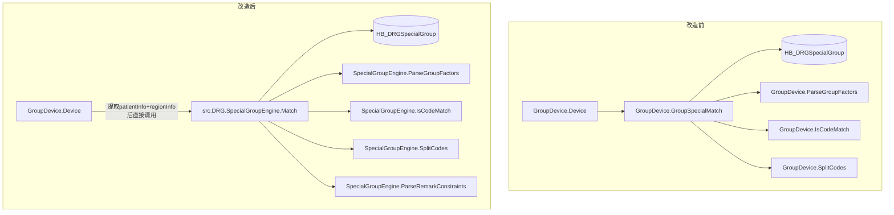

## 用户需求

以 02010001 分组接口的真实入参 JSON 为驱动，创建一个与 `src.DRG.GroupDevice.cls` 完全解耦的独立 DRG 特异化分组匹配引擎模块。

## 真实入参（合肥普瑞眼科医院）

```
{
  "code": "02010001",
  "params": [{
    "mainDiagnosisCode": "H25.900",
    "mainOperationCode": "13.3x01",
    "diseInfo": [
      { "mainFlag": 1, "diagSn": 1, "diagCode": "H25.900", "diagName": "老年性白内障" },
      { "mainFlag": 0, "diagSn": 2, "diagCode": "E10.700x022", "diagName": "1型糖尿病性高血压" },
      { "mainFlag": 0, "diagSn": 3, "diagCode": "H35.004", "diagName": "高血压性视网膜病变" }
    ],
    "oprnInfo": [
      { "mainFlag": "1", "oprnSn": 1, "oprnCode": "13.3x01", "oprnName": "创伤性白内障冲洗术" },
      { "mainFlag": "0", "oprnSn": 2, "oprnCode": "13.1901", "oprnName": "白内障囊内冷凝摘出术" }
    ],
    "hospInfo": [{ "code": "H34010400768", "name": "合肥普瑞眼科医院" }],
    "groupYear": 2026,
    "insuranceAreaCode": "340100"
  }]
}
```

## 产品概述

一个纯静态工具类 `src.DRG.SpecialGroupEngine`，提供单一的公开入口方法 `Match()`，接受患者诊断/手术数据和地区信息作为纯数据输入，查询 `HB_DRGSpecialGroup` 规则表并执行结构化匹配，返回命中的特异化 DRG 编码及描述。

## 核心功能

- **独立匹配入口**：`Match(patientInfo, regionInfo, groupYear)` 返回命中的 DRG 编码，完全不依赖 GroupDevice
- **GroupFactors 结构化解析**：解析 `+`（AND）和 `或`（OR）语法，动态决定字段匹配逻辑
- **ICD 双向前缀匹配**：子类可匹配父类（H25.900 → H25.9），父类也可匹配子类（H25 → H25.900）
- **多编码逗号分隔**：规则中单字段可存多个逗号分隔编码，任一命中即匹配
- **地区+年份多维筛选**：按 Province_Dr、City_Dr、Admvs（含前缀匹配）、Year 筛选候选规则
- **首次命中即返回**：按 DRGCode 排序遍历，命中首条规则立即返回，未命中返回 errorCode="-1"
- **移除旧实现**：删除 GroupDevice 中的 GroupSpecialMatch、ParseGroupFactors、IsCodeMatch、SplitCodes 方法，Device() 直接调用新引擎

## 技术栈

- **语言**：InterSystems IRIS/Cache ObjectScript 2019+
- **基类**：`%RegisteredObject`
- **方法类型**：全部 `ClassMethod`（纯静态工具类）
- **数据存储**：`HB_DRGSpecialGroup` 持久化表（通过嵌入式 SQL 查询）
- **参数传递**：`%Library.DynamicObject` / `%Library.DynamicArray`
- **编码处理工具**：`$LIST`（$LISTBUILD/$LISTGET/$LISTLENGTH）、`$ZSTRIP`、`$TRANSLATE`、`$FIND`

## 数据模型映射

### diseInfo（诊断组）字段映射到匹配规则

| diseInfo 字段 | 含义 | 匹配 HB_DRGSpecialGroup 字段 | 匹配方式 |
| --- | --- | --- | --- |
| `mainFlag=1, diagSn=1` | 主要诊断 | `PrincipalDiagnosis` | `IsCodeMatch(patientDiag, ruleDiag)` |
| `mainFlag=0, diagSn≥2` | 次要/第三…诊断 | `SecondaryDiagnosis` | 遍历 diseInfo，逐一 `IsCodeMatch`，任一命中即通过 |


### oprnInfo（手术组）字段映射到匹配规则

| oprnInfo 字段 | 含义 | 匹配 HB_DRGSpecialGroup 字段 | 匹配方式 |
| --- | --- | --- | --- |
| `mainFlag=1, oprnSn=1` | 主要手术 | `MajorProcedure` | `IsCodeMatch(patientProc, ruleProc)` |
| `mainFlag=0, oprnSn≥2` | 次要/第三…手术 | `SecondaryProcedure` | 遍历 oprnInfo，逐一 `IsCodeMatch`，任一命中即通过 |


### 遍历时排除逻辑

```
次要诊断遍历:  for each item in diseInfo:
                 if (item.mainFlag == "1") AND (item.diagSn == "1") → 跳过（这是主诊断）
                 else → IsCodeMatch(item.diagCode, 规则.SecondaryDiagnosis的每个编码)

次要手术遍历:  for each item in oprnInfo:
                 if (item.mainFlag == "1") AND (item.oprnSn == "1") → 跳过（这是主手术）
                 else → IsCodeMatch(item.oprnCode, 规则.SecondaryProcedure的每个编码)
```

## 实现方案

### 整体架构

**移除** GroupDevice.cls 中的 `GroupSpecialMatch`、`ParseGroupFactors`、`IsCodeMatch`、`SplitCodes` 四个方法。**新引擎** `SpecialGroupEngine.cls` 完整替代其功能，Device() 方法直接调用引擎。



### 数据流（以真实入参为例）

```
02010001 接口入参
  │ jsonObj.params[0]
  ├── mainDiagnosisCode: "H25.900"     (← 同 diseInfo[diagSn=1].diagCode)
  ├── mainOperationCode: "13.3x01"     (← 同 oprnInfo[oprnSn=1].oprnCode)
  ├── diseInfo:                        (诊断组)
  │     [0] mainFlag=1, diagSn=1, diagCode="H25.900"      → 主要诊断
  │     [1] mainFlag=0, diagSn=2, diagCode="E10.700x022"   → 次要诊断
  │     [2] mainFlag=0, diagSn=3, diagCode="H35.004"       → 第三诊断
  ├── oprnInfo:                        (手术组)
  │     [0] mainFlag=1, oprnSn=1, oprnCode="13.3x01"      → 主要手术
  │     [1] mainFlag=0, oprnSn=2, oprnCode="13.1901"      → 次要手术
  └── hospInfo: [{code:"H34010400768"}]
          │
          ▼ (Device() 方法内联: 从 hospInfo → 查 CB_Hospital 获取省市)
  ┌─────────────────────────────────────┐
  │ &sql(SELECT ProvID_Dr, CityID_Dr,   │
  │      CityID_Dr->Code                │
  │      INTO :provinceDr, :cityDr,     │
  │      :admvs                         │
  │      FROM CB_Hospital               │
  │      WHERE OrganizationCode         │
  │      = :hospCode)                   │
  └─────────────────────────────────────┘
          │ 结果: provinceDr=34, cityDr=3401, admvs=340100
          ▼
  patientInfo: { mainDiagnosisCode:"H25.900", mainOperationCode:"13.3x01",
                 diseInfo:[...], oprnInfo:[...] }
  regionInfo:  { provinceDr:"34", cityDr:"3401", admvs:"340100" }
  groupYear:   "2026"
          │
          ▼ (SpecialGroupEngine.Match — 逐条规则遍历)
  SQL 查询到 9 条候选规则，按 DRGCode 排序遍历:
  每条规则执行两步判断: (1) GroupFactors 匹配 → (2) Remark 约束校验
  ┌─────────┬──────────────────────────────────────────────────────┐
  │ CB66    │ GroupFactors: h40.501≠H25.900 ❌ → 跳过              │
  │ CB26-1  │ GroupFactors: H33.502≠H25.900 ❌ → 跳过              │
  │ CB26-2  │ GroupFactors: H35.303≠H25.900 ❌ → 跳过              │
  │ CB26-3  │ GroupFactors: H43.100≠H25.900 ❌ → 跳过              │
  │ CB26-4  │ GroupFactors: H25.100 vs H25.900 → false ❌ → 跳过   │
  │ CB46    │ GroupFactors: 13.3x01 不在9选1列表中 ❌ → 跳过       │
  │ CB56    │ GroupFactors: H25.900✅ 但 13.3x01≠13.4101 ❌ → 跳过 │
  │ CB54    │ GroupFactors: H25.900✅ 但 13.3x01≠13.4100x001 ❌    │
  │ CB58    │ GroupFactors: 13.3x01≠13.7000 ❌ → 跳过              │
  └─────────┴──────────────────────────────────────────────────────┘
  (Remark 约束校验仅当 GroupFactors 匹配成功后才执行——本例无命中，不触发)
          │ 全部 9 条规则均不命中
          ▼
    返回: { errorCode: "-1", errorMessage: "未命中特异化分组规则" }
          │
          ▼ (GroupDevice 继续标准流程)
    GroupComplication → GroupDRG → 算法配置查询
```

### ICD 双向前缀匹配边界说明

`IsCodeMatch` 使用 `$FIND` 实现严格前缀关系判断，仅当一方是另一方的**直接前缀**（完全包含为子串开头）时返回 true：

| code1（入参） | code2（规则） | $FIND结果 | 匹配？ | 原因 |
| --- | --- | --- | --- | --- |
| H25.900 | H25.9 | H25.9 是前缀 | ✅ | 子类→父类 |
| H25 | H25.900 | H25 是前缀 | ✅ | 父类→子类 |
| H25.900 | H25.100 | 互不为前缀 | ❌ | 同级兄弟 |
| H50.100 | H40.501 | 互不为前缀 | ❌ | 完全无关 |


### GroupFactors + Remark 双重入组条件

**GroupFactors** 定义结构化的字段匹配逻辑（AND/OR），由 `ParseGroupFactors` 解析。

**Remark** 包含 GroupFactors 未能表达的**额外约束**，需结构化解析：

| Remark 关键模式 | 正则匹配 | 额外约束逻辑 |
| --- | --- | --- |
| `另一个作为次要(手术\ | 诊断)` | `/另一个作为次要/` | 同 DRGCode 下，非命中的主手术/主诊断编码 **必须** 出现在患者 oprnInfo/diseInfo 的次要条目中 |
| `X选1` | `/\d+选1/` | 确认多编码 OR 匹配模式（与逗号分隔一致，无需额外处理） |
| 其他文本 | — | 仅作为说明透传，不参与匹配判断 |


**算法流程更新**（以 CB26 为例）：

```
CB26 有 4 行，Remark="主要手术二选一，另一个作为次要手术"

Step 1: GroupFactors 匹配
  → 命中行2 (H35.303 + 13.4100x001, GroupFactors="主要诊断+主要手术")
  → 此时命中的主手术 = 13.4100x001

Step 2: Remark 约束校验 (如果匹配到 "另一个作为次要手术")
  → 找出同 DRGCode 下所有行的 MajorProcedure 集合
     CB26 的 MajorProcedure 集合 = {14.7401, 13.4100x001}
  → 移除本次命中的主手术 (13.4100x001)
  → "另一个" = 14.7401
  → 检查患者 oprnInfo 中是否存在 14.7401（不限主/次）
  → 存在 → 通过 ✅，返回 CB26
  → 不存在 → Remark 约束不满足 ❌，继续遍历
```

### 关键设计决策

1. **直接替换而非委托**：Device() 方法内直接调用 `##class(src.DRG.SpecialGroupEngine).Match()`，移除 GroupDevice 中的 GroupSpecialMatch/ParseGroupFactors/IsCodeMatch/SplitCodes 四个方法。Device() 负责从 jsonObj 提取 patientInfo 和 regionInfo 后传入引擎。

2. **CB_Hospital 查询保留在 Device() 中**：orgCode → provinceDr/cityDr/admvs 的转换在 Device() 内完成，引擎只接受纯数据 regionInfo，保持零依赖。

3. **代码复制而非共享**：IsCodeMatch/SplitCodes/ParseGroupFactors 完整复制到新引擎，避免循环依赖。三个方法总计约 120 行，维护负担极低。

4. **ICD 双向前缀匹配边界**：`IsCodeMatch` 使用 `$FIND` 判断严格前缀关系，仅当一方完整包含另一方作为开头子串时才返回 true。同级兄弟编码（如 H25.900 和 H25.100 共享 H25 但互不为前缀）返回 false。同时引擎内部统一转为大写（`$ZCVT(code, "U")")`，与 HB_DRGSpecialGroup 表中 DRGCode 的 COLLATION="UPPER" 保持一致。

5. **DRGDesc 格式**：命中时附加特异化标识，格式为 `"DRG名称（特异化分组：入组因素描述）"`，与现有行为一致。

6. **Remark 约束校验**：GroupFactors 匹配成功后，解析 Remark 中的额外约束模式（如"另一个作为次要手术"），在同 DRGCode 规则行间执行跨行校验，不满足则跳过当前行继续遍历。

### 性能考量

- 市级方案数据量小（< 50 条），无内存缓存需求
- Province_Dr + City_Dr + Year 联合索引保证查询效率
- 首次命中即退出循环，避免不必要的遍历

### 回滚策略

- Device() 改动前，将 GroupSpecialMatch/ParseGroupFactors/IsCodeMatch/SplitCodes 四个方法及 Device() 调用代码备份为分支或注释保留
- 若新引擎有问题，回滚 GroupDevice.cls 恢复到原始版本即可
- SpecialGroupEngine.cls 不动不影响系统运行

## Agent Extensions

### Skill

- **cloud-his-iris**: 用于确保 SpecialGroupEngine.cls 的类定义、方法签名、命名规范、SQL 嵌入语法完全符合普瑞 HIS 系统的 IRIS ObjectScript 代码规范。
- **iris代码规范**: 用于验证代码质量，包括类结构定义、Method 声明、Query 编写、事务处理、参数命名等符合项目标准。

### SubAgent

- **code-explorer**: 用于在实施前再次确认 GroupDevice.cls 中 GroupSpecialMatch 方法的完整边界（入参提取逻辑、异常处理分支），以及 HB_DRGSpecialGroup 表上所有索引定义。