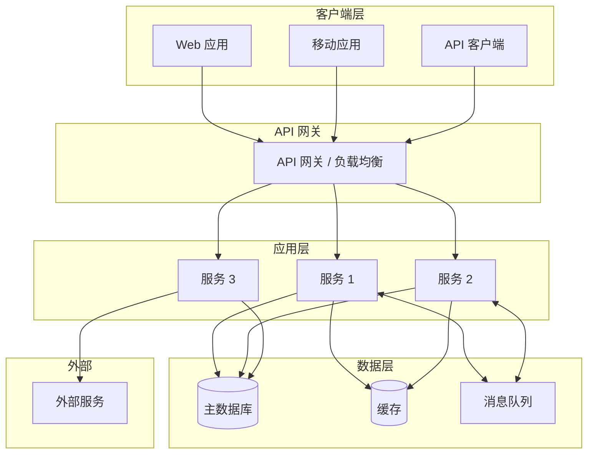
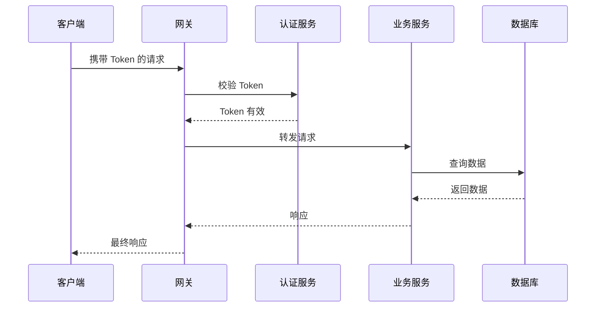
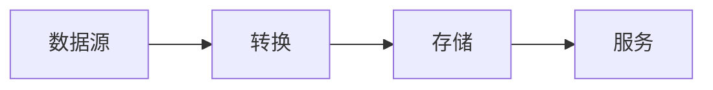
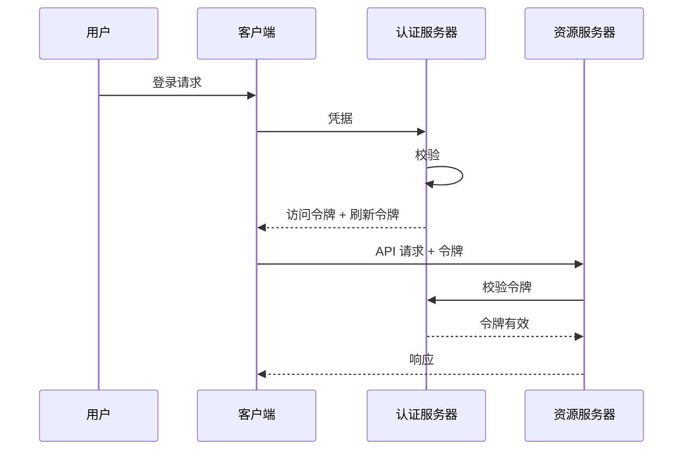

# 架构规范模板

> 阶段 4 模板：系统架构规范

---

## 文档信息

| 字段 | 值 |
|------|-----|
| 项目名称 | `{项目名称}` |
| 版本 | `1.0.0` |
| 创建日期 | `{日期}` |

---

## 1. 架构概述

### 1.1 高层架构

### 1.2 架构模式

| 模式 | 描述 |
|------|------|
| 类型 | 单体 / 微服务 / 无服务器 |
| 通信方式 | REST / GraphQL / gRPC / 事件驱动 |
| 数据策略 | 共享数据库 / 每服务一库 |

---

## 2. 技术栈

### 2.1 前端技术栈

| 组件 | 技术 | 版本 | 选择理由 |
|------|------|------|----------|
| 框架 | | | |
| 状态管理 | | | |
| UI 组件库 | | | |
| 构建工具 | | | |

### 2.2 后端技术栈

| 组件 | 技术 | 版本 | 选择理由 |
|------|------|------|----------|
| 运行时 | | | |
| 框架 | | | |
| ORM | | | |
| 校验库 | | | |

### 2.3 数据技术栈

| 组件 | 技术 | 版本 | 选择理由 |
|------|------|------|----------|
| 主数据库 | | | |
| 缓存 | | | |
| 消息队列 | | | |
| 搜索引擎 | | | |

### 2.4 基础设施技术栈

| 组件 | 技术 | 选择理由 |
|------|------|----------|
| 云服务商 | | |
| 容器编排 | | |
| CI/CD | | |
| 监控 | | |

---

## 3. 组件架构

### 3.1 组件目录

| 组件 | 类型 | 描述 | 所属模块 |
|------|------|------|----------|
| API 网关 | 基础设施 | 请求路由、限流 | 平台 |
| 认证服务 | 服务 | 认证、授权 | MOD-AUTH |
| | | | |

### 3.2 组件交互

---

## 4. 数据架构

### 4.1 数据库设计原则

| 原则 | 描述 |
|------|------|
| 命名规范 | 表/列使用 snake_case |
| 主键 | UUID v4 |
| 软删除 | 使用 `deleted_at` 列 |
| 时间戳 | 所有表包含 `created_at`, `updated_at` |

### 4.2 数据流

### 4.3 数据所有权

| 数据库/模式 | 负责人 | 用途 |
|-------------|--------|------|
| | | |

---

## 5. 集成架构

### 5.1 内部集成

| 集成点 | 协议 | 模式 | 描述 |
|--------|------|------|------|
| 服务间通信 | HTTP/REST | 同步 | 直接 API 调用 |
| 事件通信 | 消息队列 | 异步 | 发布/订阅模式 |

### 5.2 外部集成

| 系统 | 协议 | 认证方式 | 用途 |
|------|------|----------|------|
| | | | |

### 5.3 API 版本策略

| 策略 | 实现方式 |
|------|----------|
| URL 版本控制 | `/api/v1/resource` |
| Header 版本控制 | `Accept: application/vnd.api+json;version=1` |

---

## 6. 安全架构

### 6.1 认证流程

### 6.2 安全层级

| 层级 | 控制措施 |
|------|----------|
| 网络 | 防火墙、VPC、安全组 |
| 传输 | TLS 1.3、证书固定 |
| 应用 | 输入校验、OWASP Top 10 防护 |
| 数据 | 静态加密、字段级加密 |

### 6.3 密钥管理

| 密钥类型 | 存储位置 | 轮换周期 |
|----------|----------|----------|
| API 密钥 | Vault/云密钥管理 | 90 天 |
| 数据库凭据 | Vault | 30 天 |
| JWT 签名密钥 | KMS | 180 天 |

---

## 7. 可扩展性架构

### 7.1 扩展策略

| 组件 | 扩展类型 | 触发条件 |
|------|----------|----------|
| API 服务器 | 水平扩展 | CPU > 70% |
| 数据库 | 垂直扩展 + 只读副本 | 连接数 > 80% |
| 缓存 | 水平扩展 | 内存 > 80% |

### 7.2 负载均衡

| 层级 | 方法 | 健康检查 |
|------|------|----------|
| L4 (TCP) | 轮询 | TCP 连接 |
| L7 (HTTP) | 最少连接 | HTTP /health |

### 7.3 容量规划

| 指标 | 当前 | 6 个月 | 12 个月 |
|------|------|--------|---------|
| 日活用户 | | | |
| 请求/秒 | | | |
| 数据存储 (GB) | | | |

---

## 8. 部署架构

### 8.1 环境配置

| 环境 | 用途 | 数据 | 扩展 |
|------|------|------|------|
| 开发环境 | 功能开发 | 模拟数据 | 单实例 |
| 测试环境 | 集成测试 | 脱敏数据 | 类生产 |
| 生产环境 | 正式流量 | 真实数据 | 自动扩展 |

### 8.2 部署流水线

### 8.3 基础设施即代码

| 工具 | 用途 |
|------|------|
| Terraform | 云基础设施 |
| Docker | 容器化 |
| Kubernetes | 编排 |

---

## 9. 可观测性架构

### 9.1 监控技术栈

| 组件 | 工具 | 用途 |
|------|------|------|
| 指标 | Prometheus/Grafana | 系统和应用指标 |
| 日志 | ELK Stack | 集中式日志 |
| 链路追踪 | Jaeger/Zipkin | 分布式追踪 |

### 9.2 告警策略

| 严重程度 | 响应时间 | 通知方式 |
|----------|----------|----------|
| 严重 | 5 分钟 | 电话 + 即时通讯 |
| 警告 | 1 小时 | 即时通讯 |
| 信息 | 下个工作日 | 邮件 |

### 9.3 SLI/SLO

| SLI | SLO | 测量方式 |
|-----|-----|----------|
| 可用性 | 99.9% | 正常运行监控 |
| 延迟 (P95) | < 500ms | APM |
| 错误率 | < 0.1% | 错误追踪 |

---

## 10. 灾难恢复

### 10.1 备份策略

| 数据类型 | 频率 | 保留期 | 存储位置 |
|----------|------|--------|----------|
| 数据库 | 每小时 | 30 天 | 跨区域 |
| 文件存储 | 每天 | 90 天 | 跨区域 |
| 配置 | 变更时 | 永久 | Git |

### 10.2 恢复流程

| 场景 | RTO | RPO | 恢复步骤 |
|------|-----|-----|----------|
| 数据库故障 | 1 小时 | 1 小时 | 故障转移到副本 |
| 区域故障 | 4 小时 | 1 小时 | 激活灾备站点 |

---

## 11. 架构决策记录 (ADR)

### ADR-001：{决策标题}

| 属性 | 值 |
|------|-----|
| 状态 | 提议中 / 已采纳 / 已废弃 |
| 日期 | |
| 背景 | 要解决什么问题？ |
| 决策 | 建议/实施的变更是什么？ |
| 后果 | 有哪些权衡？ |

---

## 12. 合规与标准

### 12.1 标准合规

| 标准 | 要求 | 实现方式 |
|------|------|----------|
| 等保三级 | 数据保护 | 访问控制、加密存储 |
| SOC 2 | 安全控制 | 审计日志、访问控制 |

### 12.2 代码标准

| 标准 | 工具 | 配置文件 |
|------|------|----------|
| 代码检查 | ESLint/Pylint | `.eslintrc` / `.pylintrc` |
| 代码格式化 | Prettier/Black | `.prettierrc` / `pyproject.toml` |
| 类型检查 | TypeScript/mypy | `tsconfig.json` / `mypy.ini` |

---

## 校验清单

- [ ] 所有模块已定义技术选型
- [ ] 安全架构覆盖所有攻击面
- [ ] 可扩展性策略满足增长预期
- [ ] 部署流水线完全自动化
- [ ] 监控覆盖所有关键指标
- [ ] 灾难恢复已记录并测试
- [ ] ADR 记录了关键决策
