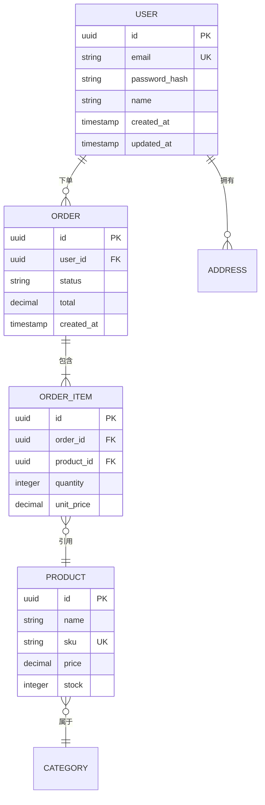

# 数据库设计规范模板

> 阶段 4 模板：数据库 Schema 设计

---

## 文档信息

| 字段 | 值 |
|------|-----|
| 项目名称 | `{项目名称}` |
| 版本 | `1.0.0` |
| 创建日期 | `{日期}` |
| 数据库类型 | PostgreSQL / MySQL / SQL Server |

---

## 1. 数据库概述

### 1.1 数据库策略

| 属性 | 值 |
|------|-----|
| 类型 | 关系型 / 文档型 / 混合 |
| 实例 | 单机 / 主从 / 集群 |
| 字符集 | UTF-8 (utf8mb4) |
| 排序规则 | utf8mb4_unicode_ci |

### 1.2 模式组织

| 模式/数据库 | 用途 | 负责人 |
|-------------|------|--------|
| public | 主应用数据 | app_user |
| audit | 审计日志 | audit_user |

---

## 2. 实体关系图

### 2.1 高层 ERD



### 2.2 实体数量估算

| 实体 | 预估行数（初始） | 增长率 |
|------|------------------|--------|
| users | 1,000 | 100/月 |
| orders | 5,000 | 500/月 |
| products | 500 | 50/月 |

---

## 3. 表定义

### 3.1 用户表

```sql
CREATE TABLE users (
    id              UUID PRIMARY KEY DEFAULT gen_random_uuid(),
    email           VARCHAR(255) NOT NULL,
    password_hash   VARCHAR(255) NOT NULL,
    name            VARCHAR(100),
    status          VARCHAR(20) NOT NULL DEFAULT 'active',
    email_verified  BOOLEAN NOT NULL DEFAULT FALSE,
    created_at      TIMESTAMP WITH TIME ZONE NOT NULL DEFAULT NOW(),
    updated_at      TIMESTAMP WITH TIME ZONE NOT NULL DEFAULT NOW(),
    deleted_at      TIMESTAMP WITH TIME ZONE,

    CONSTRAINT uk_users_email UNIQUE (email),
    CONSTRAINT ck_users_status CHECK (status IN ('active', 'suspended', 'deleted'))
);
```

**字段规格：**

| 字段 | 类型 | 可空 | 默认值 | 描述 |
|------|------|------|--------|------|
| id | UUID | 否 | gen_random_uuid() | 主键 |
| email | VARCHAR(255) | 否 | - | 用户邮箱（唯一） |
| password_hash | VARCHAR(255) | 否 | - | Bcrypt 哈希 |
| name | VARCHAR(100) | 是 | NULL | 显示名称 |
| status | VARCHAR(20) | 否 | 'active' | 账户状态 |
| email_verified | BOOLEAN | 否 | FALSE | 邮箱验证标志 |
| created_at | TIMESTAMPTZ | 否 | NOW() | 创建时间 |
| updated_at | TIMESTAMPTZ | 否 | NOW() | 更新时间 |
| deleted_at | TIMESTAMPTZ | 是 | NULL | 软删除时间 |

**索引：**

| 索引名称 | 字段 | 类型 | 用途 |
|----------|------|------|------|
| uk_users_email | email | UNIQUE | 邮箱查找 |
| idx_users_status | status | BTREE | 按状态筛选 |
| idx_users_created_at | created_at | BTREE | 排序 |

### 3.2 订单表

```sql
CREATE TABLE orders (
    id              UUID PRIMARY KEY DEFAULT gen_random_uuid(),
    user_id         UUID NOT NULL,
    status          VARCHAR(20) NOT NULL DEFAULT 'pending',
    total_amount    DECIMAL(10, 2) NOT NULL,
    currency        VARCHAR(3) NOT NULL DEFAULT 'CNY',
    shipping_address JSONB,
    notes           TEXT,
    created_at      TIMESTAMP WITH TIME ZONE NOT NULL DEFAULT NOW(),
    updated_at      TIMESTAMP WITH TIME ZONE NOT NULL DEFAULT NOW(),
    deleted_at      TIMESTAMP WITH TIME ZONE,

    CONSTRAINT fk_orders_user FOREIGN KEY (user_id)
        REFERENCES users(id) ON DELETE RESTRICT,
    CONSTRAINT ck_orders_status CHECK (status IN ('pending', 'confirmed', 'shipped', 'delivered', 'cancelled')),
    CONSTRAINT ck_orders_total CHECK (total_amount >= 0)
);

CREATE INDEX idx_orders_user_id ON orders(user_id);
CREATE INDEX idx_orders_status ON orders(status);
CREATE INDEX idx_orders_created_at ON orders(created_at);
```

*每个表重复此结构*

---

## 4. 索引策略

### 4.1 索引类型

| 类型 | 用途 | 示例 |
|------|------|------|
| BTREE | 等值、范围查询 | 默认索引类型 |
| HASH | 仅等值查询 | 精确匹配查找 |
| GIN | 全文、JSON | JSONB 字段、数组 |
| GiST | 几何、全文 | 空间数据 |

### 4.2 索引设计规则

| 规则 | 描述 |
|------|------|
| 选择性 | 索引高基数的列 |
| 覆盖索引 | 包含频繁访问的列 |
| 组合索引 | 按选择性排序（最高选择性在前） |
| 避免过度索引 | 每个索引都有写入成本 |

### 4.3 查询到索引映射

| 查询模式 | 推荐索引 |
|----------|----------|
| `WHERE email = ?` | email 上建 UNIQUE |
| `WHERE user_id = ? ORDER BY created_at DESC` | 组合索引 (user_id, created_at DESC) |
| `WHERE status = ? AND created_at > ?` | 组合索引 (status, created_at) |
| name 上全文搜索 | 带 tsvector 的 GIN |

---

## 5. 约束

### 5.1 主键

| 表 | 字段 | 类型 | 生成方式 |
|----|------|------|----------|
| users | id | UUID | gen_random_uuid() |
| orders | id | UUID | gen_random_uuid() |

### 5.2 外键

| 约束 | 源表 | 目标表 | 删除时 | 更新时 |
|------|------|--------|--------|--------|
| fk_orders_user | orders.user_id | users.id | RESTRICT | CASCADE |
| fk_order_items_order | order_items.order_id | orders.id | CASCADE | CASCADE |
| fk_order_items_product | order_items.product_id | products.id | RESTRICT | CASCADE |

### 5.3 检查约束

| 表 | 约束 | 规则 |
|----|------|------|
| users | ck_users_status | status IN ('active', 'suspended', 'deleted') |
| orders | ck_orders_total | total_amount >= 0 |
| products | ck_products_price | price >= 0 |
| products | ck_products_stock | stock >= 0 |

### 5.4 唯一约束

| 表 | 字段 | 用途 |
|----|------|------|
| users | email | 每邮箱一个账户 |
| products | sku | 唯一产品标识 |

---

## 6. 数据类型参考

### 6.1 标准类型

| 用途 | PostgreSQL | MySQL | SQL Server | 备注 |
|------|------------|-------|------------|------|
| 主键 | UUID | CHAR(36) | UNIQUEIDENTIFIER | 分布式系统首选 UUID |
| 短字符串 | VARCHAR(50) | VARCHAR(50) | NVARCHAR(50) | 名称、代码 |
| 中字符串 | VARCHAR(255) | VARCHAR(255) | NVARCHAR(255) | 邮箱、URL |
| 长字符串 | TEXT | TEXT | NVARCHAR(MAX) | 描述、内容 |
| 整数 | INTEGER | INT | INT | 计数、ID |
| 金额 | DECIMAL(10,2) | DECIMAL(10,2) | DECIMAL(10,2) | 财务金额 |
| 布尔 | BOOLEAN | TINYINT(1) | BIT | 标志位 |
| 时间戳 | TIMESTAMPTZ | DATETIME | DATETIMEOFFSET | 始终使用时区 |
| JSON | JSONB | JSON | NVARCHAR(MAX) | 灵活模式数据 |

### 6.2 类型选择指南

| 数据 | 推荐类型 | 理由 |
|------|----------|------|
| 邮箱 | VARCHAR(255) | 标准最大长度 |
| 手机号 | VARCHAR(20) | 国际格式 |
| 金额 | DECIMAL(m,n) | 需要精度 |
| 状态 | VARCHAR(20) + CHECK | 明确的值 |
| 时间戳 | TIMESTAMPTZ | 时区感知 |

---

## 7. 迁移策略

### 7.1 迁移命名

```
{时间戳}_{操作}_{描述}.sql

示例：
20240115120000_create_users_table.sql
20240115130000_add_email_verified_to_users.sql
20240115140000_create_orders_index.sql
```

### 7.2 迁移模板

```sql
-- 迁移：创建用户表
-- 创建日期：2024-01-15

-- Up
CREATE TABLE users (
    id UUID PRIMARY KEY DEFAULT gen_random_uuid(),
    email VARCHAR(255) NOT NULL,
    created_at TIMESTAMP WITH TIME ZONE NOT NULL DEFAULT NOW()
);

CREATE INDEX idx_users_email ON users(email);

-- Down
DROP TABLE IF EXISTS users;
```

### 7.3 迁移最佳实践

| 实践 | 描述 |
|------|------|
| 向后兼容 | 新列可空或有默认值 |
| 不加锁 | 并发创建索引 (CONCURRENTLY) |
| 批量更新 | 分批处理大批量更新 |
| 先测试 | 在生产数据副本的测试环境运行 |

---

## 8. 查询模式

### 8.1 常用查询

#### 获取用户及其订单

```sql
SELECT
    u.id,
    u.email,
    u.name,
    json_agg(
        json_build_object(
            'id', o.id,
            'status', o.status,
            'total', o.total_amount
        )
    ) AS orders
FROM users u
LEFT JOIN orders o ON o.user_id = u.id
WHERE u.id = $1
GROUP BY u.id;
```

#### 带筛选的分页列表

```sql
SELECT *
FROM orders
WHERE status = $1
  AND created_at >= $2
ORDER BY created_at DESC
LIMIT $3 OFFSET $4;
```

### 8.2 查询优化指南

| 指南 | 描述 |
|------|------|
| 使用 EXPLAIN ANALYZE | 验证查询计划 |
| 避免 SELECT * | 只选择需要的列 |
| 使用预编译语句 | 参数化查询 |
| 批量处理大操作 | 分块处理 |

---

## 9. 数据完整性

### 9.1 事务隔离级别

| 级别 | 用途 |
|------|------|
| READ COMMITTED | 默认，大多数操作 |
| REPEATABLE READ | 报表，需要一致性 |
| SERIALIZABLE | 关键财务操作 |

### 9.2 事务模板

```sql
BEGIN;

-- 检查前置条件
SELECT status FROM orders WHERE id = $1 FOR UPDATE;

-- 执行操作
UPDATE orders SET status = 'confirmed' WHERE id = $1;
INSERT INTO order_events (order_id, event, created_at)
VALUES ($1, 'confirmed', NOW());

COMMIT;
```

### 9.3 数据校验层级

| 层级 | 校验 |
|------|------|
| 应用层 | Schema 校验、业务规则 |
| 数据库 | CHECK 约束、触发器 |
| 引用 | 外键约束 |

---

## 10. 备份与恢复

### 10.1 备份策略

| 类型 | 频率 | 保留期 | 工具 |
|------|------|--------|------|
| 全量 | 每天 | 30 天 | pg_dump |
| 增量 | 每小时 | 7 天 | WAL 归档 |
| 时间点 | 持续 | 7 天 | WAL + 基础备份 |

### 10.2 备份命令

```bash
# 全量备份
pg_dump -Fc -Z9 -f backup_$(date +%Y%m%d).dump dbname

# 仅结构
pg_dump -s -f schema.sql dbname

# 仅数据
pg_dump -a -f data.sql dbname
```

### 10.3 恢复流程

| 场景 | 恢复步骤 |
|------|----------|
| 表删除 | 从备份恢复到临时库，复制表 |
| 数据损坏 | 时间点恢复 |
| 数据库丢失 | 从最新备份完整恢复 |

---

## 11. 性能监控

### 11.1 关键指标

| 指标 | 告警阈值 |
|------|----------|
| 连接数 | > max_connections 的 80% |
| 查询时间 (P95) | > 500ms |
| 锁等待时间 | > 5s |
| 表膨胀 | > 30% |
| 索引使用率 | < 90% |

### 11.2 监控查询

```sql
-- 慢查询
SELECT query, mean_exec_time, calls
FROM pg_stat_statements
ORDER BY mean_exec_time DESC
LIMIT 10;

-- 表膨胀
SELECT schemaname, tablename,
       pg_size_pretty(pg_total_relation_size(schemaname||'.'||tablename)) AS size
FROM pg_tables
ORDER BY pg_total_relation_size(schemaname||'.'||tablename) DESC
LIMIT 10;

-- 索引使用
SELECT schemaname, tablename, indexname, idx_scan
FROM pg_stat_user_indexes
ORDER BY idx_scan ASC;
```

### 11.3 维护任务

| 任务 | 频率 | 命令 |
|------|------|------|
| VACUUM ANALYZE | 每天（自动） | autovacuum |
| REINDEX | 每月 | REINDEX TABLE CONCURRENTLY |
| 统计信息更新 | 每天 | ANALYZE |

---

## 12. 安全

### 12.1 访问控制

| 角色 | 权限 | 用途 |
|------|------|------|
| app_user | 应用表的 SELECT, INSERT, UPDATE, DELETE | 应用访问 |
| readonly_user | 应用表的 SELECT | 报表 |
| migration_user | 应用表的 ALL, CREATE | Schema 迁移 |

### 12.2 行级安全（如适用）

```sql
-- 启用 RLS
ALTER TABLE orders ENABLE ROW LEVEL SECURITY;

-- 策略：用户只能看到自己的订单
CREATE POLICY orders_select_policy ON orders
    FOR SELECT
    USING (user_id = current_setting('app.current_user_id')::UUID);
```

### 12.3 数据加密

| 数据 | 加密方式 |
|------|----------|
| 静态数据 | TDE / 磁盘加密 |
| 传输数据 | TLS 1.3 |
| PII 字段 | 应用层加密 |

---

## 13. 审计日志

### 13.1 审计表结构

```sql
CREATE TABLE audit_logs (
    id              UUID PRIMARY KEY DEFAULT gen_random_uuid(),
    table_name      VARCHAR(100) NOT NULL,
    operation       VARCHAR(10) NOT NULL,
    record_id       UUID NOT NULL,
    old_values      JSONB,
    new_values      JSONB,
    changed_by      UUID,
    changed_at      TIMESTAMP WITH TIME ZONE NOT NULL DEFAULT NOW(),
    ip_address      INET
);

CREATE INDEX idx_audit_logs_table_record ON audit_logs(table_name, record_id);
CREATE INDEX idx_audit_logs_changed_at ON audit_logs(changed_at);
```

### 13.2 审计触发器

```sql
CREATE OR REPLACE FUNCTION audit_trigger()
RETURNS TRIGGER AS $$
BEGIN
    INSERT INTO audit_logs (table_name, operation, record_id, old_values, new_values, changed_by)
    VALUES (
        TG_TABLE_NAME,
        TG_OP,
        COALESCE(NEW.id, OLD.id),
        CASE WHEN TG_OP IN ('UPDATE', 'DELETE') THEN row_to_json(OLD) END,
        CASE WHEN TG_OP IN ('INSERT', 'UPDATE') THEN row_to_json(NEW) END,
        current_setting('app.current_user_id', true)::UUID
    );
    RETURN NEW;
END;
$$ LANGUAGE plpgsql;
```

---

## 校验清单

- [ ] 所有实体有主键
- [ ] 外键关系已定义
- [ ] 查询模式有合适的索引
- [ ] 检查约束强制数据有效性
- [ ] 迁移策略已文档化
- [ ] 备份流程已定义
- [ ] 性能监控已规划
- [ ] 访问控制已实现
- [ ] 审计日志已配置
