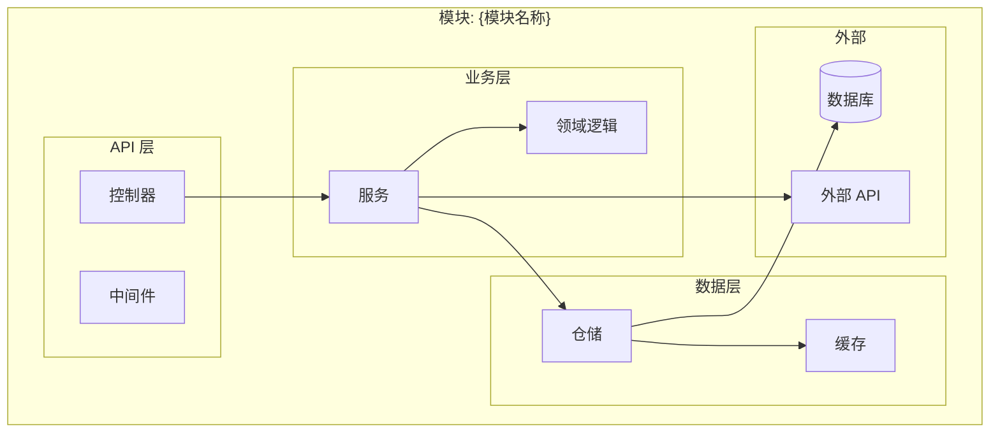
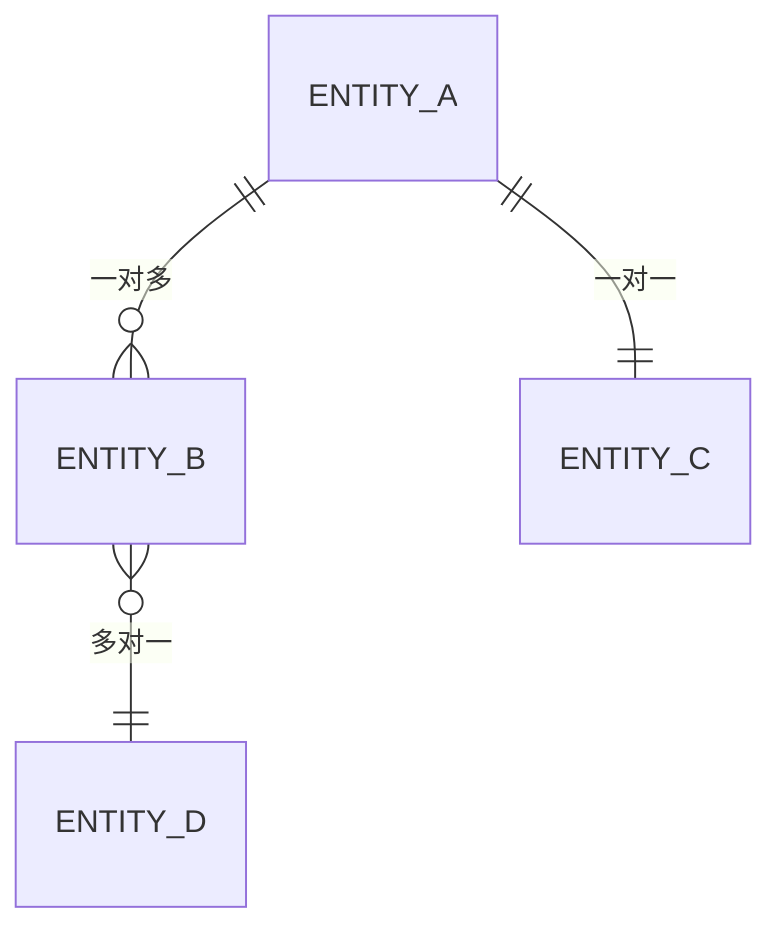
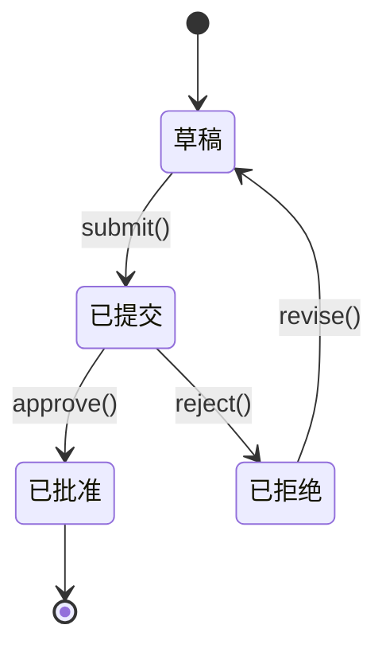

# 模块详细设计模板

> 阶段 3 模板：模块详细设计

---

## 文档信息

| 字段 | 值 |
|------|-----|
| 项目名称 | `{项目名称}` |
| 模块编号 | `{MOD-XXX}` |
| 模块名称 | `{模块名称}` |
| 版本 | `1.0.0` |
| 创建日期 | `{日期}` |
| 基于文档 | 模块规划 v1.0.0 |

---

## 1. 模块概述

### 1.1 目的

*此模块解决什么业务问题？*

### 1.2 范围

**范围内：**
- 能力 1
- 能力 2

**范围外：**
- 能力 X（由 MOD-YYY 处理）

### 1.3 需求映射

| 需求编号 | 需求 | 实现方案 |
|----------|------|----------|
| FR-001 | | |

---

## 2. 组件架构

### 2.1 组件图



### 2.2 组件说明

| 组件 | 职责 | 技术实现 |
|------|------|----------|
| 控制器 | 处理 HTTP 请求 | |
| 服务 | 业务逻辑 | |
| 仓储 | 数据访问 | |

---

## 3. API 契约

### 3.1 端点概览

| 方法 | 端点 | 描述 | 需认证 |
|------|------|------|--------|
| GET | /api/v1/resource | 列表查询 | 是 |
| POST | /api/v1/resource | 创建资源 | 是 |
| GET | /api/v1/resource/:id | 按 ID 查询 | 是 |
| PUT | /api/v1/resource/:id | 更新资源 | 是 |
| DELETE | /api/v1/resource/:id | 删除资源 | 是 |

### 3.2 端点详情

#### GET /api/v1/resource

**描述：** 分页查询资源列表

**请求：**

```http
GET /api/v1/resource?page=1&limit=20&sort=createdAt:desc
Authorization: Bearer {token}
```

**查询参数：**

| 参数 | 类型 | 必填 | 默认值 | 描述 |
|------|------|------|--------|------|
| page | integer | 否 | 1 | 页码 |
| limit | integer | 否 | 20 | 每页数量（最大 100） |
| sort | string | 否 | createdAt:desc | 排序字段和方向 |

**响应 (200 OK)：**

```json
{
  "data": [
    {
      "id": "string",
      "name": "string",
      "createdAt": "ISO8601 日期",
      "updatedAt": "ISO8601 日期"
    }
  ],
  "pagination": {
    "page": 1,
    "limit": 20,
    "total": 100,
    "totalPages": 5
  }
}
```

**错误响应：**

| 状态码 | 错误码 | 消息 |
|--------|--------|------|
| 400 | INVALID_PARAMS | 查询参数无效 |
| 401 | UNAUTHORIZED | 需要认证 |
| 500 | INTERNAL_ERROR | 服务器错误 |

---

#### POST /api/v1/resource

**描述：** 创建新资源

**请求：**

```http
POST /api/v1/resource
Authorization: Bearer {token}
Content-Type: application/json

{
  "name": "string (必填, 最长 100 字符)",
  "description": "string (可选, 最长 500 字符)"
}
```

**请求体 Schema：**

| 字段 | 类型 | 必填 | 校验规则 |
|------|------|------|----------|
| name | string | 是 | 1-100 字符 |
| description | string | 否 | 最长 500 字符 |

**响应 (201 Created)：**

```json
{
  "id": "uuid",
  "name": "string",
  "description": "string",
  "createdAt": "ISO8601 日期",
  "updatedAt": "ISO8601 日期"
}
```

*每个端点重复此结构*

---

## 4. 数据模型

### 4.1 实体定义

#### 实体：{实体名称}

| 字段 | 类型 | 必填 | 索引 | 描述 |
|------|------|------|------|------|
| id | UUID | 是 | PK | 主键 |
| name | VARCHAR(100) | 是 | | 资源名称 |
| createdAt | TIMESTAMP | 是 | IDX | 创建时间 |
| updatedAt | TIMESTAMP | 是 | | 更新时间 |

### 4.2 实体关系



### 4.3 数据校验规则

| 字段 | 校验规则 | 错误码 |
|------|----------|--------|
| name | 必填, 1-100 字符 | NAME_REQUIRED, NAME_TOO_LONG |
| email | 有效邮箱格式 | INVALID_EMAIL |

---

## 5. 业务逻辑

### 5.1 服务方法

| 方法 | 描述 | 事务 |
|------|------|------|
| createResource() | 创建资源 | 是 |
| updateResource() | 更新资源 | 是 |
| deleteResource() | 软删除资源 | 是 |

### 5.2 业务规则

| 规则编号 | 描述 | 实现方式 |
|----------|------|----------|
| BR-001 | 用户只能修改自己的资源 | 服务层检查 userId |
| BR-002 | 名称在用户范围内唯一 | 数据库唯一约束 |

### 5.3 状态机（如适用）



---

## 6. 错误处理

### 6.1 错误分类

| 分类 | HTTP 状态码 | 示例 |
|------|-------------|------|
| 校验错误 | 400 | 输入数据无效 |
| 认证错误 | 401 | Token 过期 |
| 授权错误 | 403 | 权限不足 |
| 未找到 | 404 | 资源不存在 |
| 冲突 | 409 | 资源重复 |
| 限流 | 429 | 请求过多 |
| 服务器错误 | 500 | 未知错误 |

### 6.2 错误响应格式

```json
{
  "error": {
    "code": "ERROR_CODE",
    "message": "可读的错误信息",
    "details": [
      {
        "field": "fieldName",
        "message": "具体校验错误"
      }
    ],
    "requestId": "uuid",
    "timestamp": "ISO8601 日期"
  }
}
```

### 6.3 错误码

| 错误码 | HTTP 状态码 | 描述 | 用户提示 |
|--------|-------------|------|----------|
| RESOURCE_NOT_FOUND | 404 | 资源不存在 | 请求的资源未找到 |
| DUPLICATE_NAME | 409 | 名称已存在 | 该名称已被使用 |

---

## 7. 安全

### 7.1 认证要求

- [ ] 需要 JWT Token 校验
- [ ] Token 刷新机制
- [ ] 会话超时：X 分钟

### 7.2 授权规则

| 角色 | 创建 | 读取 | 更新 | 删除 |
|------|------|------|------|------|
| 管理员 | ✓ | ✓ | ✓ | ✓ |
| 用户 | ✓ | 仅自己 | 仅自己 | 仅自己 |
| 访客 | ✗ | ✓ | ✗ | ✗ |

### 7.3 数据保护

| 数据 | 分类 | 保护措施 |
|------|------|----------|
| 个人信息 | 机密 | 静态加密 |
| 财务数据 | 限制级 | 加密 + 审计日志 |

---

## 8. 性能

### 8.1 缓存策略

| 数据 | 缓存类型 | TTL | 失效策略 |
|------|----------|-----|----------|
| 资源列表 | Redis | 5 分钟 | 创建/更新/删除时 |
| 单个资源 | Redis | 10 分钟 | 更新/删除时 |

### 8.2 查询优化

| 查询 | 优化方式 | 预期时间 |
|------|----------|----------|
| 列表查询 | createdAt 索引 | < 50ms |
| 名称搜索 | 全文索引 | < 100ms |

### 8.3 限流配置

| 端点 | 限制 | 时间窗口 |
|------|------|----------|
| GET /api/v1/resource | 100 次 | 1 分钟 |
| POST /api/v1/resource | 20 次 | 1 分钟 |

---

## 9. 事件

### 9.1 发布事件

| 事件 | 触发条件 | 载荷 |
|------|----------|------|
| resource.created | 创建后 | `{ resourceId, userId }` |
| resource.updated | 更新后 | `{ resourceId, changedFields }` |
| resource.deleted | 删除后 | `{ resourceId }` |

### 9.2 订阅事件

| 事件 | 来源 | 处理动作 |
|------|------|----------|
| user.deleted | 认证模块 | 清理用户资源 |

---

## 10. 测试策略

### 10.1 单元测试

| 组件 | 覆盖目标 | 关键测试用例 |
|------|----------|--------------|
| 服务 | 90% | 业务规则、边界情况 |
| 仓储 | 80% | CRUD 操作 |

### 10.2 集成测试

| 场景 | 描述 |
|------|------|
| API-001 | 成功创建资源 |
| API-002 | 使用无效数据创建 |
| API-003 | 未授权访问 |

### 10.3 测试数据

| 实体 | 测试数据 | 清理方式 |
|------|----------|----------|
| 资源 | 预置 100 条测试记录 | 每个测试套件后 |

---

## 11. 依赖

### 11.1 内部依赖

| 模块 | 类型 | 用途 |
|------|------|------|
| MOD-AUTH | 服务 | 认证 |

### 11.2 外部依赖

| 服务 | 类型 | 降级方案 |
|------|------|----------|
| 数据库 | 必需 | 无（失败） |
| 缓存 | 推荐 | 无缓存继续 |

---

## 12. 监控

### 12.1 指标

| 指标 | 类型 | 告警阈值 |
|------|------|----------|
| request.duration | 直方图 | P95 > 500ms |
| request.count | 计数器 | - |
| error.rate | 仪表盘 | > 1% |

### 12.2 日志

| 级别 | 记录事件 |
|------|----------|
| ERROR | 异常、操作失败 |
| WARN | 限流触发、缓存未命中 |
| INFO | 资源创建/更新/删除 |
| DEBUG | 详细请求/响应 |

---

## 13. 部署

### 13.1 配置

| 变量 | 描述 | 默认值 |
|------|------|--------|
| MODULE_PORT | 服务端口 | 3000 |
| DB_CONNECTION | 数据库连接串 | - |

### 13.2 健康检查

```http
GET /health
```

```json
{
  "status": "healthy",
  "version": "1.0.0",
  "dependencies": {
    "database": "healthy",
    "cache": "healthy"
  }
}
```

---

## 14. 校验清单

模块设计完成前，请确认：

- [ ] 所有需求已覆盖
- [ ] API 契约已完整定义
- [ ] 错误处理已覆盖
- [ ] 安全需求已满足
- [ ] 性能目标可实现
- [ ] 事件已记录
- [ ] 测试策略已定义
- [ ] 监控已规划
