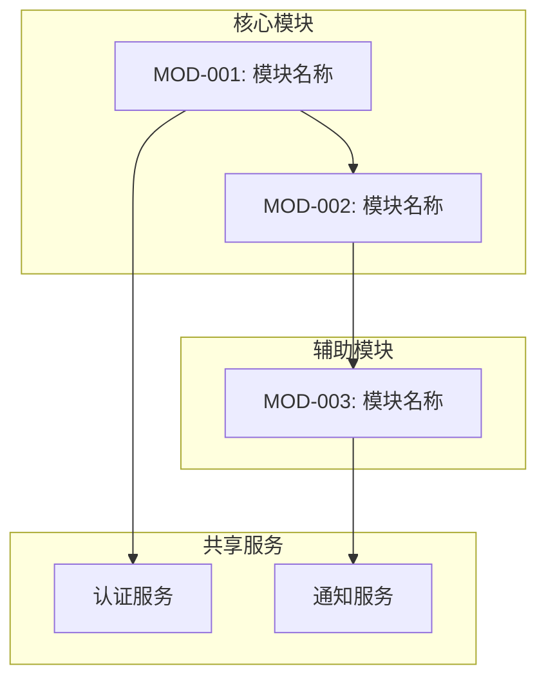
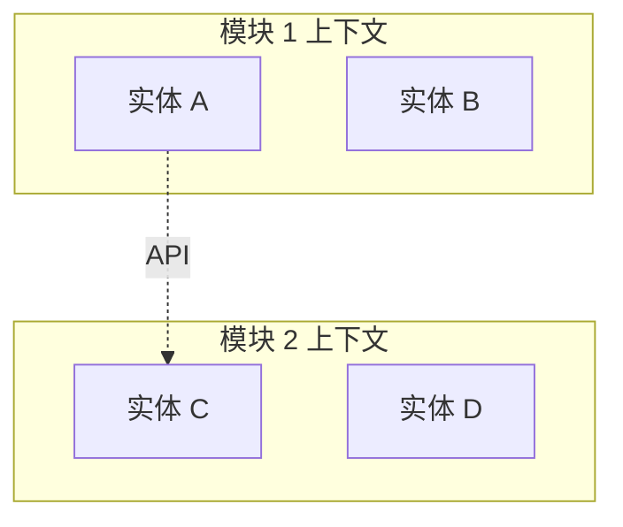

# 模块规划模板

> 阶段 2 模板：业务模块分解

---

## 文档信息

| 字段 | 值 |
|------|-----|
| 项目名称 | `{项目名称}` |
| 版本 | `1.0.0` |
| 创建日期 | `{日期}` |
| 基于文档 | 需求规格书 v1.0.0 |

---

## 1. 模块概述

### 1.1 模块汇总

| 模块编号 | 模块名称 | 描述 | 优先级 |
|----------|----------|------|--------|
| MOD-001 | | | 高/中/低 |
| MOD-002 | | | |
| MOD-003 | | | |

### 1.2 模块统计

- 模块总数：X
- 核心模块：Y（必须有）
- 辅助模块：Z（应该有/可选）

---

## 2. 模块依赖关系图

---

## 3. 模块详情

### 3.1 MOD-001：{模块名称}

#### 概述

| 属性 | 值 |
|------|-----|
| 模块编号 | MOD-001 |
| 名称 | |
| 类型 | 核心 / 辅助 / 共享 |
| 优先级 | 高 / 中 / 低 |
| 预估复杂度 | 低 / 中 / 高 |

#### 功能范围

*此模块提供哪些业务能力？*

#### 需求覆盖

| 需求编号 | 需求 | 覆盖程度 |
|----------|------|----------|
| FR-001 | | 完整 / 部分 |
| FR-002 | | 完整 / 部分 |

#### 依赖关系

| 依赖模块 | 类型 | 描述 |
|----------|------|------|
| MOD-002 | 数据 | 需要 MOD-002 的用户数据 |
| AUTH | 服务 | 需要认证服务 |

#### 暴露接口

| 接口 | 类型 | 描述 |
|------|------|------|
| API | REST/GraphQL | |
| 事件 | 发布/订阅 | |

#### 风险评估

| 风险 | 概率 | 影响 | 缓解措施 |
|------|------|------|----------|
| | 低/中/高 | 低/中/高 | |

---

### 3.2 MOD-002：{模块名称}

*每个模块重复此结构*

---

## 4. 共享服务

### 4.1 横切关注点

| 服务 | 使用模块 | 描述 |
|------|----------|------|
| 认证服务 | 所有模块 | 基于 JWT 的认证 |
| 日志服务 | 所有模块 | 集中式日志 |
| 配置服务 | 所有模块 | 功能开关、环境变量 |

### 4.2 共享数据实体

| 实体 | 所属模块 | 共享给 | 访问模式 |
|------|----------|--------|----------|
| 用户 | MOD-001 | MOD-002, MOD-003 | 只读 |

---

## 5. 集成点

### 5.1 内部集成

| 源模块 | 目标模块 | 集成类型 | 数据 |
|--------|----------|----------|------|
| MOD-001 | MOD-002 | 同步 API | 用户资料 |

### 5.2 外部集成

| 模块 | 外部系统 | 集成类型 | 用途 |
|------|----------|----------|------|
| MOD-001 | 支付网关 | REST API | 处理支付 |

---

## 6. 实施顺序

### 6.1 建议顺序

| 阶段 | 模块 | 理由 |
|------|------|------|
| 1 | MOD-001 | 基础模块，无依赖 |
| 2 | MOD-002 | 依赖 MOD-001 |
| 3 | MOD-003 | 依赖 MOD-002 |

### 6.2 并行开发机会

*可以同时开发的模块：*

- MOD-002 和 MOD-003（MOD-001 完成后）

---

## 7. 复杂度估算

### 7.1 复杂度矩阵

| 模块 | 业务逻辑 | 技术复杂度 | 集成复杂度 | 综合评估 |
|------|----------|------------|------------|----------|
| MOD-001 | 中 | 低 | 低 | 低-中 |
| MOD-002 | 高 | 中 | 中 | 中-高 |

### 7.2 工作量估算指南

| 复杂度 | 典型工期 | 团队规模 |
|--------|----------|----------|
| 低 | 1-2 周 | 1-2 人 |
| 中 | 2-4 周 | 2-3 人 |
| 高 | 4-8 周 | 3-5 人 |

---

## 8. 可追溯性矩阵

### 8.1 需求到模块映射

| 需求 | MOD-001 | MOD-002 | MOD-003 |
|------|---------|---------|---------|
| FR-001 | ✓ | | |
| FR-002 | ✓ | ✓ | |
| FR-003 | | ✓ | ✓ |

### 8.2 覆盖分析

- 需求总数：X
- 完全覆盖：Y
- 部分覆盖：Z
- 未覆盖：N

---

## 9. 模块边界

### 9.1 限界上下文

*定义模块间的清晰边界以防止耦合：*

### 9.2 数据所有权

| 数据实体 | 所属模块 | 读权限 | 写权限 |
|----------|----------|--------|--------|
| | MOD-001 | 所有模块 | 仅 MOD-001 |

---

## 10. 校验清单

进入模块设计阶段前，请确认：

- [ ] 所有需求已分配到模块
- [ ] 模块依赖关系已记录
- [ ] 不存在循环依赖
- [ ] 共享服务已识别
- [ ] 实施顺序已定义
- [ ] 复杂度估算合理
- [ ] 模块边界清晰
